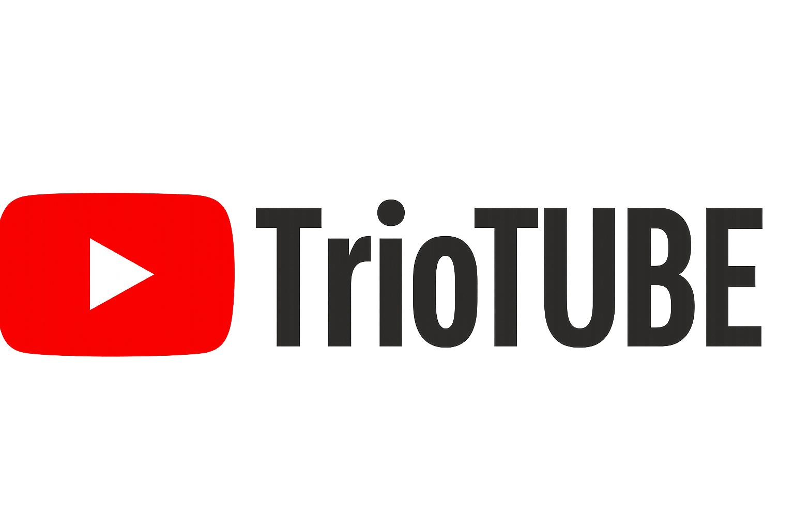

# 🎬 TrioTUBE — Your Personalized YouTube-Like Experience

Welcome to **TrioTUBE**, a modern and sleek YouTube clone built using **React**, **Tailwind CSS**, and powered by the **Google YouTube Data API**. The platform offers users a smooth and fast interface to explore, watch, and engage with trending videos across categories — all within a clean, responsive UI.

 <!-- Add your actual logo or screenshot path -->

---

## LIVE DEMO : 

## 🚀 Tech Stack

- ⚛️ **React.js** – Fast, component-based frontend
- 🎨 **Tailwind CSS** – Utility-first responsive UI framework
- ☁️ **Google YouTube Data API v3** – Real-time video, channel, and comment fetching

---

## 📽️ Features

- 🔍 **Dynamic Video Feed** by category
- 🎥 **Detailed Video View Page** with:
  - Embedded video player
  - Channel info, stats & description
  - Like/Dislike and Download UI
  - Comment section powered by YouTube API
- 🌙 **Dark Mode / Light Mode** toggle
- 📱 **Fully Responsive UI**

---

## 🛠️ Upcoming Features

We're just getting started! Here's what's on the roadmap:

- 🔐 **User Authentication**
  - Sign Up / Sign In
  - Persistent login sessions
- ⬆️ **Upload Video Feature**
  - Users will be able to post their own content
- 🧑‍🤝‍🧑 **Follow Creators**
  - Personalized feed based on followed channels
- 💬 **Custom Comments**
  - Post & interact with comments natively
- 🧠 **AI-Powered Recommendations**
  - Smart suggestions based on viewing history
- 🎨 **Creator Dashboard**
  - Analytics, uploads, subscribers & more!

## 🔥 TrioTUBE — Watch. Create. Connect.

## ❤️ Built With Love

This project was crafted with:

- ⚡ Passion for real-time technology
- 💡 Curiosity about API Integration
- 🧠 Learning mindset and commitment to growth
- 🍵 Countless cups of tea and coffee

> **"Crafting code that connects the world, one line at a time."**

---

## 👨‍💻 Author

**Trisanjit Das**  
[🌐 Portfolio](https://trisanjit-rising-hope.netlify.app) • [💼 LinkedIn](https://www.linkedin.com/in/trisanjit-das-60482728b) • 📧 trisanjitwork.official@gmail.com

## 📜 License

This project is licensed under the **MIT License**.

See the full license details in the [`LICENSE`](./LICENSE) file.

